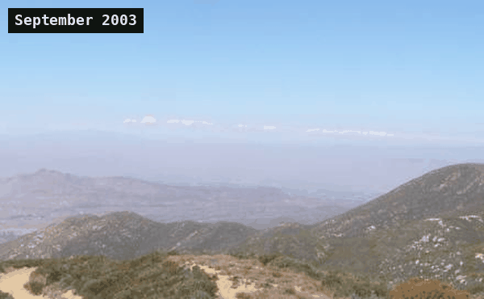
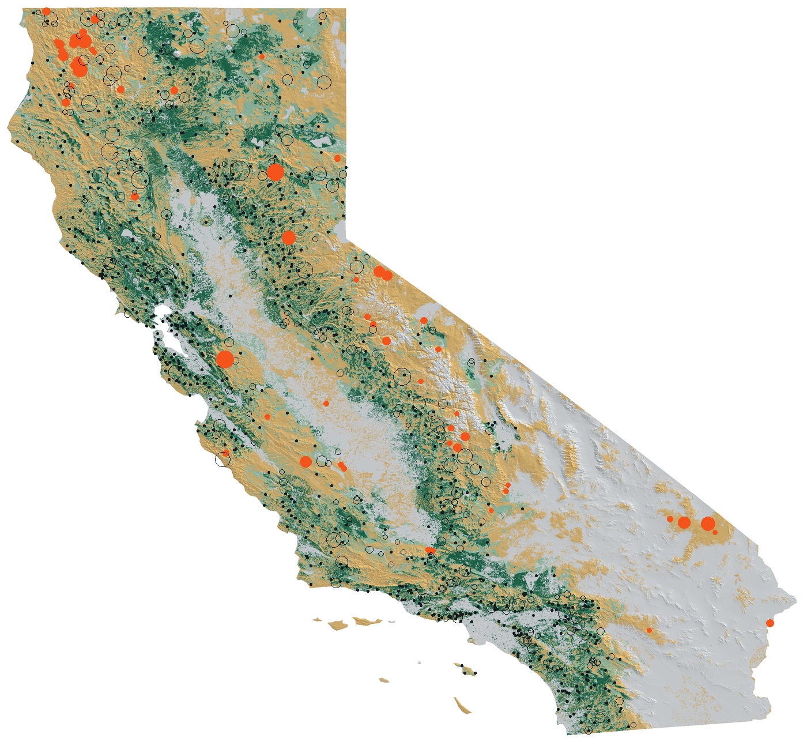

# Fuel Gauge

**Turn any fixed camera into a measuring instrument.**

Fuel Gauge is an open-source Python pipeline for fire lookouts, phenology cameras and webcams. Give it a folder of photos and a location. It keeps years of frames aligned, works out where the camera points from the skyline alone, ties every pixel to the ground and hands back a daily vegetation record you can compare across seasons. It also maps what a whole network of cameras can see and where new ones would help most.

[Project site](https://shourya0mehta.github.io/fuel-gauge/) | [Docs](https://shourya0mehta.github.io/fuel-gauge/docs.html) | [Research results](https://shourya0mehta.github.io/fuel-gauge/research.html) | MIT licence



*One Forest Service camera, 2003 to 2018, April and September of each year, registered by the pipeline onto one view.*

## Install

```bash
pip install "fuelgauge[geo,seg] @ git+https://github.com/shourya0mehta/fuel-gauge"
```

Python 3.10+. `geo` adds terrain and land cover (Microsoft Planetary Computer, GeoTIFF output), `seg` adds the SegFormer-B2 segmentation model (ONNX Runtime, CPU only, downloaded once), `eval` adds scoring against field data.

## Quickstart

```bash
# years of photos from one camera -> registered views -> daily vegetation series
fuelgauge run photos/ out/ridge
#   out/ridge_daily.csv     daily GRVI / GCC per view, raw and white-balanced, plus a joined index
#   out/ridge_regions.png   the anchor frame with the measured vegetation and reference blocks marked
#   out/ridge_blocks.npz    block colours of every registered photo; out/ridge_qa.json per-photo QA

# one frame + location -> camera pose + pixel-to-ground lookup
fuelgauge calibrate ridge frame.jpg --lat 33.4008 --lon -117.1905 --elev 483 --yaw 90

# what a set of cameras can see, and where to add more (CSV with lat, lon columns)
fuelgauge viewshed cameras.csv coverage.tif
fuelgauge site cameras.csv --k 10 > new_sites.csv
```

Photo times come from the file name (`2019-06-14_1230.jpg`, `IMG_20190614T123000.jpg`, PhenoCam and HPWREN naming) or EXIF. Each stage is also a Python function:

```python
from fuelgauge.archive import process
from fuelgauge.measure import measure
from fuelgauge import terrain, viewshed, evaluate

blocks = process(paths, times, "out/ridge")                 # register
daily, regions, info = measure(blocks, "out/ridge")         # measure
dem = terrain.load_planetary("cop-dem-glo-90", "data", 33.4, -117.2, 40000)
picks = viewshed.site(dem, existing=[(33.40, -117.19)], k=5) # site new cameras
```

## The pipeline

| Stage | What it solves | Techniques |
| --- | --- | --- |
| **1. Register** `track`, `archive` | Cameras drift, get bumped, re-aimed and moved over years | Frame screening (brightness, Laplacian sharpness, contrast, clipping); SIFT on CLAHE-equalised greyscale, Lowe ratio 0.75; 4-DOF similarity by RANSAC; keyframe tracking with relocalisation; loop closure over stretches via a maximum-inlier spanning tree; relocated cameras kept as second views; in-place fallback for featureless scenes; bump detection |
| **2. Measure** `measure`, `quality`, `rois`, `colour` | Raw colour is mostly haze, weather and sensor drift | Haze score from Sobel edge correlation with the anchor frame, relative to a trailing 90-day norm; automatic regions from SegFormer-B2 (ADE20K) vegetation labels plus seasonal amplitude; drift-tracking von Kries white balance against flat reference blocks (trailing 61-day median); GRVI, GCC and camera NDVI from IR twins (Petach et al. 2014); causal smoothing safe for nowcasting |
| **3. Calibrate** `terrain`, `camera` | Public cameras come with a location and nothing else | Sky segmentation to a per-column skyline snapped to edges; terrain panorama from Copernicus 30 m DEM with earth curvature and refraction (k = 0.13); equidistant fisheye with one radial term; heading, tilt and roll by bounded Powell search on a trimmed loss; one lens fitted jointly across a camera network |
| **4. Georeference** `terrain.backproject` | Photo measurements need a place on the map | Ray to first terrain hit for every pixel block: distance, latitude, longitude, slope, aspect, ESA WorldCover class |
| **5. Network coverage** `viewshed` | Which ground can a set of cameras actually see, and where would one more help | Radial viewsheds (0.1° rays to 30 km, curvature and refraction); smoke-column line of sight; greedy maximum-coverage siting over hilltop candidates |
| **Evaluate** `evaluate` | Does a camera signal know anything the calendar doesn't | Leave-one-year-out ridge regression on a per-site, per-species seasonal baseline; held-out predictors clipped to the training range; RMSE, anomaly correlation, years beating season |

Tests cover synthetic drift, re-aims, relocations, terrain, viewsheds, siting, colour drift and leakage in the evaluation (`pytest`, run in CI on Python 3.10 and 3.12).

## What it found

Every result below was produced with the pipeline on public data; each has an interactive page on the [research site](https://shourya0mehta.github.io/fuel-gauge/research.html).

**What California's fire cameras can see.** Line of sight from all 1,309 ALERTCalifornia cameras (740 sites) across a 90 m terrain model, checked against every California wildfire from 2020 to 2025.

- **46%** of the state's wildland is in line of sight of at least one camera within 30 km, **20%** of two (enough to triangulate smoke).
- Of the **277** fires over 1,000 acres, a camera could see the ground where each started for **43%**, and a 300 m smoke column above it for **79%** (**59%** from two cameras).
- The **21%** that started where no camera could see even that burned **1.4 million acres**, among them the SCU Lightning Complex and the Claremont Fire.
- A greedy search over 11,847 hilltops finds ten sites that would add **9,332 km²** of watched wildland. Looking back, a different ten would have seen 60 of the 317 fires no camera could see, **1.31 million of their 1.48 million acres**.
- Largest blind spots: Klamath Mountains (11,406 km²), Yosemite high country (8,250 km²), Modoc Plateau, Diablo Range.



**Can camera photos read fuel moisture?** 29,047 daily photos from 21 PhenoCam cameras in 6 states, registered and measured by the pipeline, scored against 3,832 field samples of live fuel moisture (Globe-LFMC) and MODIS.

- **Registration held up**: 92% of 31,451 usable photos landed on a fixed view; six relocated cameras kept those years as a second view.
- **Automatic regions beat hand-drawn ones** at 12 of 20 cameras (anomaly correlation 0.13 against 0.07).
- **White balance is the camera's biggest lever**: anomaly correlation 0.08 uncorrected, 0.13 corrected.
- **But colour is not moisture.** The corrected camera matches the seasonal baseline (20.5 against 20.5 points RMSE) and beats it at 10 of 21 cameras. Satellite shortwave infrared at the sampling site beats it at 15 of 21 (sign test p = 0.04, anomaly r 0.31). Near-infrared camera NDVI from 10 cameras reached 0.02. Greenness lags moisture.

**A live fire-camera network.** Eight HPWREN cameras calibrated from their skylines (median error 0.04° to 0.17°, one shared lens). A GitHub Action pulls each day's midday frames, measures every ground block and commits the numbers to the site.

## What's in here

| Path | What it is |
| --- | --- |
| [`fuelgauge/`](fuelgauge) | The package and the `fuelgauge` command |
| [`docs/`](docs) | The site: product page, docs (generated by `scripts/build_docs.py`), research pages and live data |
| [`scripts/`](scripts) | The studies end to end: download, register, score, map, siting, site data |
| [`live/`](live) | The daily updater for the calibrated HPWREN cameras, run by GitHub Actions |
| [`study/`](study) | Camera list, per-camera results and coverage statistics |
| [`tests/`](tests) | Synthetic cameras and terrain |

## Reproduce the study

```bash
pip install -e ".[geo,seg,eval,dev]"
export DATA=data
python scripts/fetch_lfmc.py                  # Globe-LFMC 2.0 field samples
python scripts/fetch_phenocam.py              # midday photos for the cameras in study/cameras.json
python scripts/fetch_modis.py                 # MODIS MCD43A4 at each camera view and sampling site
python scripts/register_phenocam.py <camera>  # once per camera (STRIDE=2 keeps every other day)
python scripts/fetch_nir.py <cam,cam,...>     # near-infrared twins + exposures for IR-capable cameras
python scripts/nir.py <cam> ...               # camera NDVI on the registered regions
python scripts/study.py && python scripts/timing.py && python scripts/summary.py
python scripts/fetch_fires.py                 # NIFC WFIGS California wildfire ignitions
python scripts/coverage.py && python scripts/siting.py && python scripts/coverage_report.py   # viewsheds, siting, stats, maps
python scripts/build_site_data.py             # docs/data/ for the site
```

The full run downloads about 60,000 photos and took a few hours on two CPU cores. The San Bernardino camera was registered from every daily photo at 960 px; the others from every other day at 768 px, since field samples are two to four weeks apart.

## Limits

- The coverage map uses today's camera network against fires from 2020 to 2025, so it asks what today's cameras would have seen. It assumes each site can pan through a full circle, sees 30 km, and ignores haze, night, trees right around the mast and where a camera happened to be pointed. Ignition points come from incident reports and can be off by hundreds of metres; a lightning complex is a single point for many starts.

- Field samples sit up to 25 km from each camera, often on a different slope and sometimes a different species from the brush in view. That is the biggest drag on every optical predictor here, and the camera most of all.
- Ordinary cameras record red, green and blue. Leaf water shows most clearly in shortwave infrared, which only the satellite has. Colour tracks greenness, which follows moisture with a lag.
- The study cameras are research cameras, mostly retired. The live fire cameras have no field samples close enough to score, so the live network reports change, not fuel moisture.
- Crews sample every two to four weeks, so each camera has tens to hundreds of samples over 4 to 16 years. Several cameras share sampling sites, so cameras are not fully independent tests.

## Data and credits

- **PhenoCam Network** (phenocam.nau.edu). Richardson et al. (2018), *Tracking vegetation phenology across diverse North American biomes using PhenoCam imagery*, Scientific Data 5:180028. Per-camera acknowledgements are in [study/ACKNOWLEDGEMENTS.md](study/ACKNOWLEDGEMENTS.md).
- **HPWREN** camera network, University of California San Diego (hpwren.ucsd.edu). Images courtesy of HPWREN.
- **Globe-LFMC 2.0**. Yebra et al. (2024), Scientific Data 11:332, compiled in part from the US National Fuel Moisture Database.
- **MODIS MCD43A4 v6.1** (NASA LP DAAC), **Copernicus DEM GLO-30** (ESA) and **ESA WorldCover 2021**, all through Microsoft Planetary Computer.
- **SegFormer-B2** fine-tuned on ADE20K (NVIDIA), ONNX export by Xenova on Hugging Face.
- **ALERTCalifornia** camera network (UC San Diego, with CAL FIRE): camera positions from the public camera map.
- **NIFC WFIGS** wildland fire incident locations (National Interagency Fire Center, public ArcGIS service).
- Camera NDVI method: Petach et al. (2014), *Monitoring vegetation phenology using an infrared-enabled security camera*, Agricultural and Forest Meteorology 195-196:143-151.

This is a research project, not an operational fire-danger product.

## Citation

See [CITATION.cff](CITATION.cff).
