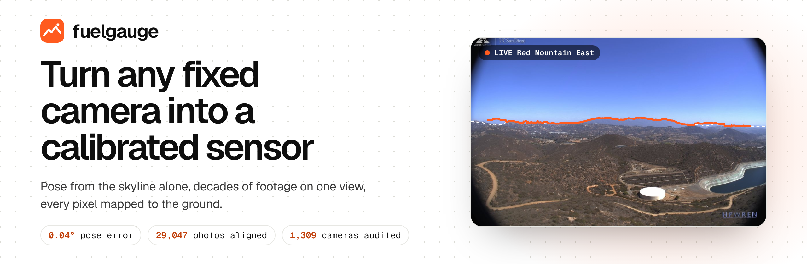
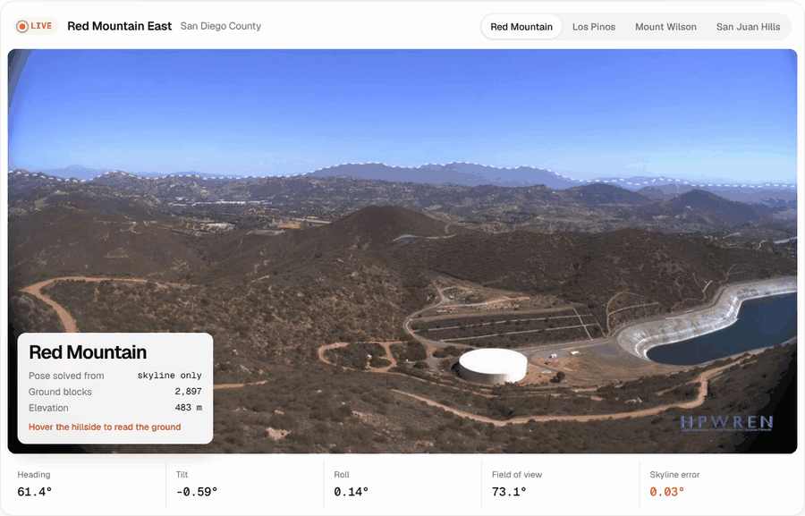

<p align="center">
  <a href="https://shourya0mehta.github.io/fuel-gauge/"></a>
</p>

<p align="center">
  <a href="https://github.com/shourya0mehta/fuel-gauge/actions/workflows/tests.yml"></a>
  <a href="https://github.com/shourya0mehta/fuel-gauge/actions/workflows/site.yml"></a>
  
  
  <a href="LICENSE"></a>
</p>

<p align="center">
  <a href="https://shourya0mehta.github.io/fuel-gauge/"><b>Website</b></a> &nbsp;|&nbsp;
  <a href="https://shourya0mehta.github.io/fuel-gauge/docs.html"><b>Docs</b></a> &nbsp;|&nbsp;
  <a href="https://shourya0mehta.github.io/fuel-gauge/research.html"><b>Research</b></a> &nbsp;|&nbsp;
  <a href="https://shourya0mehta.github.io/fuel-gauge/#live"><b>Live network</b></a>
</p>

**Fuel Gauge is open-source computer vision that tells a camera exactly where it is looking.** It solves a camera's pose from the skyline alone, holds decades of footage on one fixed view, maps every pixel to a spot on the ground, and measures how the land changes. No survey, no ground control points, no hand-drawn masks, and it runs on a laptop.

Thousands of cameras already watch wildland for fire. California alone runs 1,309 of them, each posting a frame a minute. To the software behind them a pixel is only a colour, with no distance and no place on a map. Fuel Gauge turns that colour into a measurement.

<p align="center"></p>
<p align="center"><sub>A live HPWREN fire camera after calibration. Orange: the skyline Fuel Gauge found in the photo. Dashed: the skyline a 30 m terrain model predicts from the solved pose, 0.04° apart.</sub></p>

## Highlights

<table>
  <tr>
    <td align="center" width="33%"><h3>0.04°</h3><sub>median skyline error after solving a fire camera's pose from one photo</sub></td>
    <td align="center" width="33%"><h3>29,047</h3><sub>photos from 21 cameras and 20 years locked onto fixed views</sub></td>
    <td align="center" width="33%"><h3>1,309</h3><sub>California fire cameras audited for line of sight in one run</sub></td>
  </tr>
  <tr>
    <td align="center" width="33%"><h3>1.4M acres</h3><sub>burned since 2020 by fires that started where no camera could see the smoke</sub></td>
    <td align="center" width="33%"><h3>88%</h3><sub>of that out-of-view acreage seen by ten cameras placed by the siting search</sub></td>
    <td align="center" width="33%"><h3>8 cameras</h3><sub>calibrated, live, and measured every morning by GitHub Actions</sub></td>
  </tr>
</table>

## Quickstart

```bash
pip install "fuelgauge[geo,seg] @ git+https://github.com/shourya0mehta/fuel-gauge"

# years of photos from one camera -> aligned views -> daily vegetation record
fuelgauge run photos/ out/ridge

# one frame + a location -> camera pose + pixel-to-ground lookup
fuelgauge calibrate ridge frame.jpg --lat 33.4008 --lon -117.1905 --elev 483 --yaw 90

# a list of camera sites -> what they can see, and where to add the next ones
fuelgauge viewshed cameras.csv coverage.tif
fuelgauge site cameras.csv --k 10 > new_sites.csv
```

Photo times are read from file names (ISO dates, PhenoCam and HPWREN naming) or EXIF, so most archives work as they are. Every step is also a Python function:

```python
from fuelgauge.archive import process
from fuelgauge.measure import measure
from fuelgauge import terrain, viewshed

blocks = process(paths, times, "out/ridge")                  # align
daily, regions, info = measure(blocks, "out/ridge")          # measure
dem = terrain.load_planetary("cop-dem-glo-90", "data", 33.4, -117.2, 40000)
picks = viewshed.site(dem, existing=[(33.40, -117.19)], k=5)  # site new cameras
```

Out come a daily GRVI/GCC record per view (`_daily.csv`), an image of the regions it measured (`_regions.png`), per-photo QA (`_qa.json`), a pixel-to-ground lookup (`_lookup.npz`) and a coverage GeoTIFF any GIS opens. Full guide and API reference: **[docs](https://shourya0mehta.github.io/fuel-gauge/docs.html)**.

## How it works

Five steps from raw footage to a calibrated sensor.

| Step | What it solves | Under the hood |
| --- | --- | --- |
| **1. Align** <br><sub>`track`, `archive`</sub> | Cameras drift, get bumped, re-aimed and moved over the years | Frame screening (brightness, Laplacian sharpness, contrast, clipping); SIFT on CLAHE-equalised greyscale with Lowe's ratio test; 4-DOF similarity by RANSAC; keyframe tracking with relocalisation; loop closure through a maximum-inlier spanning tree; relocated cameras kept as second views; bump and re-aim detection |
| **2. Calibrate** <br><sub>`terrain`, `camera`</sub> | Public cameras come with a location and nothing else | SegFormer-B2 sky segmentation (ONNX Runtime, CPU) to an edge-snapped skyline; terrain panorama ray-marched from Copernicus 30 m elevation with earth curvature and refraction; equidistant fisheye with one radial term; heading, tilt and roll by bounded Powell search on a trimmed loss; one lens fitted jointly across a network |
| **3. Map** <br><sub>`terrain.backproject`</sub> | A measurement needs a place on the ground | Every pixel block's ray traced to its first terrain hit: distance, latitude, longitude, slope, aspect and ESA WorldCover land cover |
| **4. Measure** <br><sub>`measure`, `quality`, `rois`, `colour`</sub> | Raw colour is mostly haze, weather and sensor drift | Haze scoring by Sobel edge correlation against a trailing norm; automatic regions from segmentation plus seasonal amplitude; drift-tracking von Kries white balance; GRVI, GCC and camera NDVI from near-infrared twins; causal smoothing that is safe to nowcast with |
| **5. Scale** <br><sub>`viewshed`</sub> | Which ground a whole network can see, and where one more camera helps most | Radial viewsheds with curvature and refraction; smoke-column line of sight; greedy maximum-coverage siting over hilltop candidates |
| **Evaluate** <br><sub>`evaluate`</sub> | Whether a camera signal knows anything the calendar does not | Leave-one-year-out ridge regression on a per-site, per-species seasonal baseline; held-out predictors clipped to the training range; RMSE, anomaly correlation and years beating season |

27 tests run in CI on Python 3.10 and 3.12, covering synthetic drift, re-aims, relocations, terrain, viewsheds, siting, colour drift and leakage in the evaluation.

## What we found with it

Every result below was produced end to end by the pipeline on public data, and each has an interactive page on the **[research site](https://shourya0mehta.github.io/fuel-gauge/research.html)**.

**A line-of-sight audit of California's fire cameras.** Fuel Gauge traced terrain line of sight from all 1,309 ALERTCalifornia cameras across the state and checked it against every wildfire from 2020 to 2025.

- **46%** of California's wildland is in view of at least one camera, and **20%** of two, the overlap needed to triangulate smoke.
- **21%** of the 277 fires over 1,000 acres started where no camera could see even a 300 m smoke column. Those fires, including the SCU Lightning Complex and the Claremont Fire, burned **1.4 million acres**.
- A siting search over 11,847 hilltops finds ten new sites that add **9,332 km²** of watched wildland. Looking back, a different ten would have seen **1.31 million of the 1.48 million acres** that burned out of view.
- The biggest blind spots: the Klamath Mountains, Yosemite's high country, the Modoc Plateau and the Diablo Range.

<p align="center"></p>

**Twenty years of footage on one view.** 29,047 daily photos from 21 PhenoCam cameras in 6 states were locked onto fixed views, including six cameras that were moved to a new mast mid-record. Automatic regions beat the network's own hand-drawn masks at 12 of 20 cameras, and drift-tracking white balance lifts the year-to-year signal by 68%.

<p align="center"></p>

**A benchmark for camera fuel moisture.** The cameras were scored against 3,832 field samples of live fuel moisture, one held-out year at a time. Satellite shortwave infrared leads (anomaly correlation 0.31, ahead of season at 15 of 21 cameras), camera colour matches the seasonal baseline, and near-infrared camera NDVI adds little. That gives the field a clear target, and the harness ships with the package so the next signal can be scored the same way.

**A live, calibrated fire-camera network.** Eight HPWREN cameras in Southern California, calibrated from their skylines with one shared lens (median error 0.04° to 0.17°). Every morning a GitHub Action pulls the latest frames, measures every ground block and publishes which slopes are drying fastest.

## Scope and what's next

- **The coverage audit shows the network at full reach.** Each site is treated as panning a full circle out to 30 km, so the gaps it finds are the floor: haze, night and where a camera happens to point only widen them. Next, per-camera aim from the live calibration.
- **The fuel moisture benchmark is scored the hard way.** Field plots sit up to 25 km from each camera, often on another slope, and are sampled every two to four weeks. Any signal that holds up here is robust.
- **Colour cameras see greenness; leaf water shows in shortwave infrared.** That is why satellite infrared leads, and why pairing camera timing with satellite infrared is the next step. The harness already scores combinations.
- **The live network reports relative drying today** and is ready to score fuel moisture as soon as field plots sit close enough to its cameras.

## Repository

| Path | What it is |
| --- | --- |
| [`fuelgauge/`](fuelgauge) | The package and the `fuelgauge` command |
| [`docs/`](docs) | The website: product page, docs (generated by `scripts/build_docs.py`), research pages and live data |
| [`scripts/`](scripts) | The studies end to end: download, align, score, map, siting and site data |
| [`live/`](live) | The daily updater for the calibrated HPWREN cameras, run by GitHub Actions |
| [`study/`](study) | Camera list, per-camera results and coverage statistics |
| [`tests/`](tests) | Synthetic cameras and terrain |

<details>
<summary><b>Reproduce the studies</b></summary>

```bash
pip install -e ".[geo,seg,eval,dev]"
export DATA=data
python scripts/fetch_lfmc.py                  # Globe-LFMC 2.0 field samples
python scripts/fetch_phenocam.py              # midday photos for the cameras in study/cameras.json
python scripts/fetch_modis.py                 # MODIS MCD43A4 at each camera view and sampling site
python scripts/register_phenocam.py <camera>  # once per camera (STRIDE=2 keeps every other day)
python scripts/fetch_nir.py <cam,cam,...>     # near-infrared twins + exposures for IR-capable cameras
python scripts/nir.py <cam> ...               # camera NDVI on the registered regions
python scripts/study.py && python scripts/timing.py && python scripts/summary.py
python scripts/fetch_fires.py                 # NIFC WFIGS California wildfire ignitions
python scripts/coverage.py && python scripts/siting.py && python scripts/coverage_report.py   # viewsheds, siting, stats, maps
python scripts/build_site_data.py             # docs/data/ for the site
```

The full run downloads about 60,000 photos and takes a few hours on two CPU cores.
</details>

## Data and credits

- **PhenoCam Network** (phenocam.nau.edu). Richardson et al. (2018), *Tracking vegetation phenology across diverse North American biomes using PhenoCam imagery*, Scientific Data 5:180028. Per-camera acknowledgements are in [study/ACKNOWLEDGEMENTS.md](study/ACKNOWLEDGEMENTS.md).
- **HPWREN** camera network, University of California San Diego (hpwren.ucsd.edu). Images courtesy of HPWREN.
- **ALERTCalifornia** camera network (UC San Diego, with CAL FIRE): camera positions from the public camera map.
- **Globe-LFMC 2.0**. Yebra et al. (2024), Scientific Data 11:332, compiled in part from the US National Fuel Moisture Database.
- **MODIS MCD43A4 v6.1** (NASA LP DAAC), **Copernicus DEM GLO-30** (ESA) and **ESA WorldCover 2021**, through Microsoft Planetary Computer.
- **SegFormer-B2** fine-tuned on ADE20K (NVIDIA), ONNX export by Xenova on Hugging Face.
- **NIFC WFIGS** wildland fire incident locations (National Interagency Fire Center).
- Camera NDVI method: Petach et al. (2014), *Monitoring vegetation phenology using an infrared-enabled security camera*, Agricultural and Forest Meteorology 195-196:143-151.

Built by Shourya Mehta. To cite, see [CITATION.cff](CITATION.cff).
